## Uncertainty in classification

### Dataset
|Name|Known class|Unknown class|
|-----|----------|----------|
|Cifar 100| 0~49 indices | 50~99 indices|
|Cifar 10| 0~4 indices | 5~9 indices|

### Hyperparameter
* Optimizer  
  - SGD, lr=0.4, momentum=0.9, weight_decay=1e-4
  - Warmup_epoch=5, warmup_factor=0.1
  - Cosine LR decay
* Hyperparameters  
  - Batch size: 128
  - Input size: 32x32
  - Epoch: 300
  - Num. of ensemble: 5
  - Num. of infer: 10
* Regularizer  
  - Augmentation: RandomCrop, HorizontalFlip
  - Mixup alpha: 0.2
  - Label smoothing: 0.1
  - Early stopping
* Scratch Learning(without ImageNet pretrained weights)

Experiments
-----------------------------------
### Cifar 100
|Method|Accuracy(train)|Accuracy(test)|ECE|
|------------|-----|-----|-----|
|Softmax|0.9297|0.6534|**0.0595**|
|Temp. scaling|0.9267|0.6386|0.1385|
|MC Dropout|0.9042|0.6778|0.0715|
|Ensemble|**0.9361**|**0.6866**|0.0822|  

Table 1. Result of ResNet18

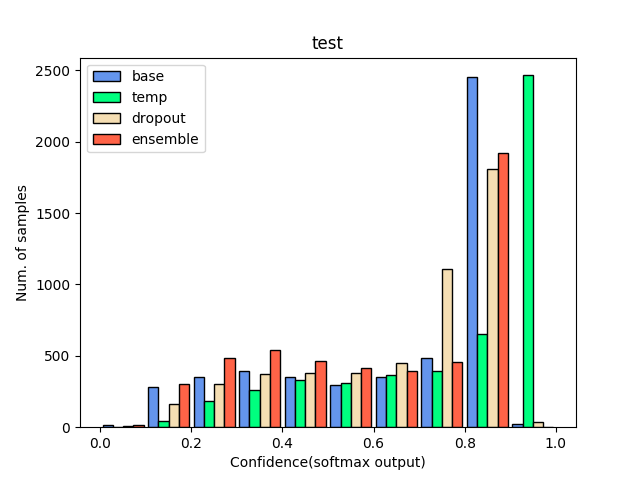  
Fig1. Distribution of confidence of the test set. ResNet18

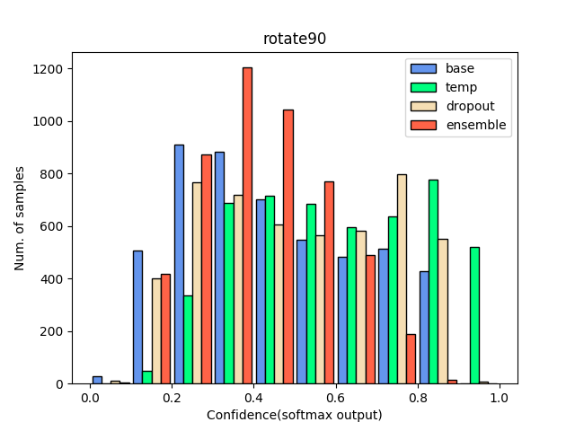  
Fig2. Distribution of confidence of the test set that rotated in 90 degree. ResNet18

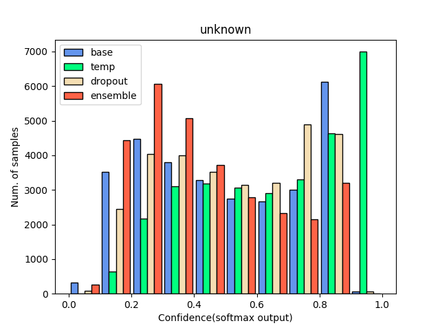  
Fig3. Distribution of confidence of the unknown data. ResNet18
  
  
|Method|Accuracy(train)|Accuracy(test)|ECE|
|------------|-----|-----|-----|
|Softmax|0.9326|0.6636|0.0796|
|Temp. scaling|0.9288|0.6402|0.1555|
|MC Dropout|0.9360|**0.7063**|0.0750|
|Ensemble|**0.9418**|0.7006|**0.0725**|

Table 2. Result of ResNet50

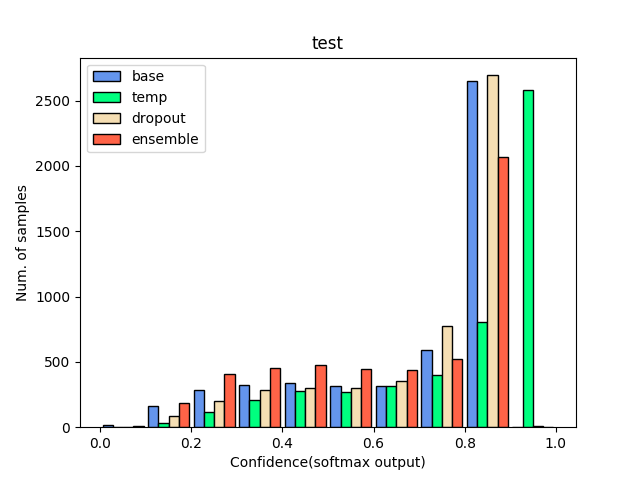  
Fig4. Distribution of confidence of the test set. ResNet50

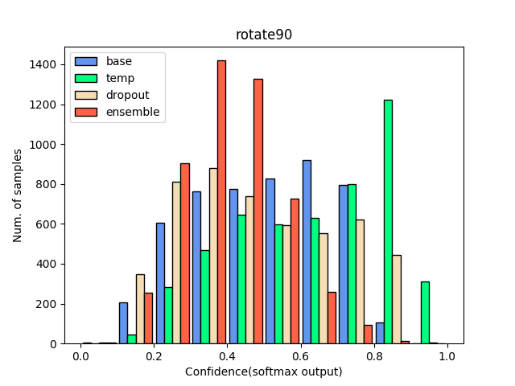  
Fig5. Distribution of confidence of the test set that rotated in 90 degree. ResNet50

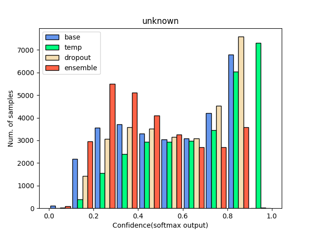  
Fig6. Distribution of confidence of the unknown data. ResNet50

### Cifar 10
|Method|Accuracy(train)|Accuracy(test)|ECE|
|------------|-----|-----|-----|
|Softmax|0.9854|0.9176|0.0870|
|Temp. scaling|0.9821|0.9092|**0.0506**|
|MC Dropout|0.9832|0.9144|0.0967|
|Ensemble|**0.9872**|**0.9320**|0.1044|

Table 3. Result of ResNet18

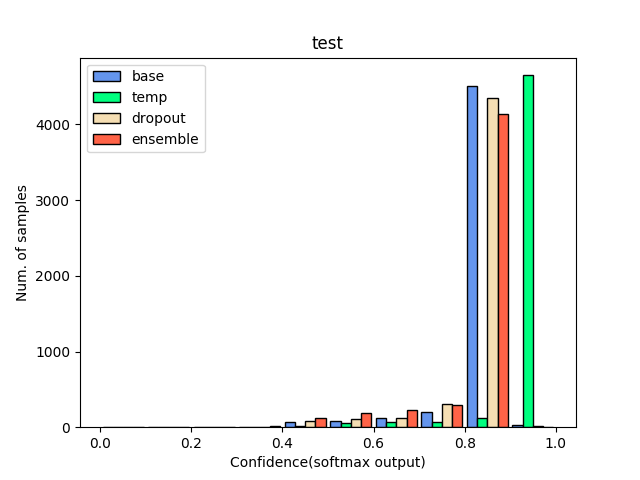  
Fig7. Distribution of confidence of the test set. ResNet18

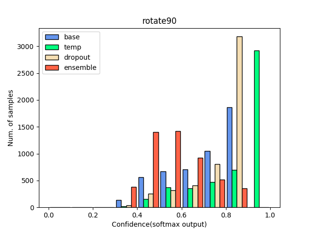  
Fig8. Distribution of confidence of the test set that rotated in 90 degree. ResNet18

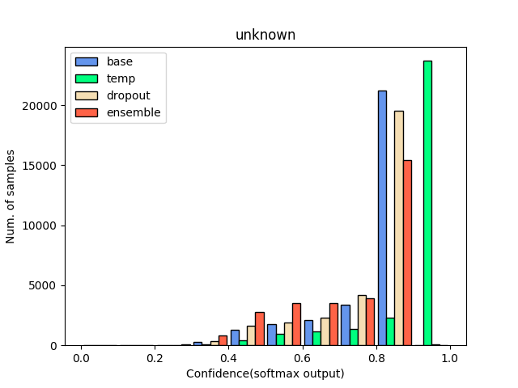  
Fig9. Distribution of confidence of the unknown data. ResNet18
  
  
|Method|Accuracy(train)|Accuracy(test)|ECE|
|------------|-----|-----|-----|
|Softmax|0.9856|0.9286|**0.1028**|
|Temp. scaling|0.0006|0.0036|0.1980|
|MC Dropout|0.9849|0.9224|0.1098|
|Ensemble|**0.9873**|**0.9368**|0.1071|

Table 4. Result of ResNet50

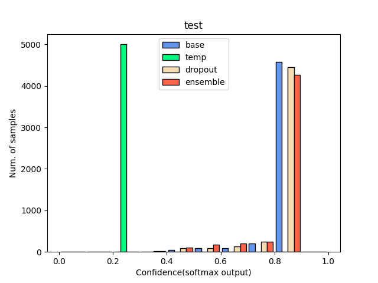  
Fig10. Distribution of confidence of the test set. ResNet50

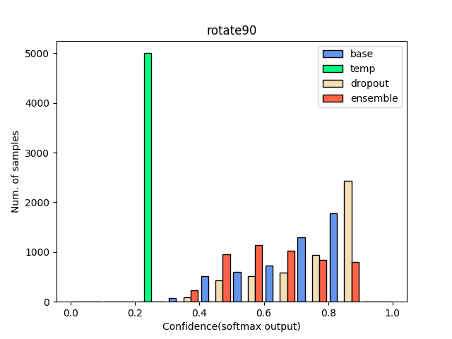  
Fig11. Distribution of confidence of the test set that rotated in 90 degree. ResNet50

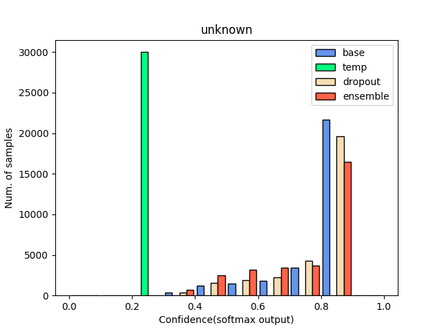  
Fig12. Distribution of confidence of the unknown data. ResNet50

Conclusion
-----------------------------------
1. Bigger model shows more overconfidence.   
2. Softmax is still good function but ensemble is better option.  
3. Dropout is also good method but too much resource need to inference.  
4. Temperature scaling shows worse result.

#### Citation
[Temperature scaling] 'On Calibration of Modern Neural Networks'  
[MC Dropout] 'Dropout as a Bayesian Approximation_Representing Model Uncertainty in Deep Learning'   
[Ensemble] 'Simple and Scalable Predictive Uncertainty Estimation using Deep Ensembles'
